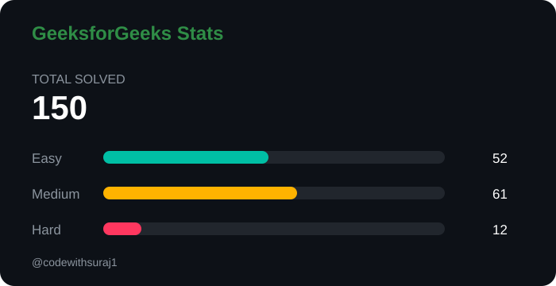

<h1 align="center">
  Hi 👋, I'm Suraj Kumar
</h1>

  

---

## 👨‍💻 About Me

* 🎓 CSE Undergraduate Student at **IIT Patna**
* 💻 MERN Stack Developer
* 🧠 Competitive Programmer & DSA Enthusiast
* 🔥 Solving problems on **LeetCode**
* 🚀 Building real-world projects
* 🌱 Always learning and improving
* 💡 Interested in Software Development & Problem Solving

---

## 🛠️ Tech Stack

### 👨‍💻 Programming Languages

  
  
  

### 🎨 Frontend Development

  
  
  
  

### ⚙️ Backend Development

  
  

### 🗄️ Database

  
  

### 🔧 Tools & Technologies

  
  
  
  
  

---

## 🧠 DSA & Competitive Programming

  
  
  

### 📚 Topics I Practice

* Arrays & Strings
* Linked Lists
* Stack & Queue
* Recursion & Backtracking
* Binary Trees & BST
* Graphs
* Dynamic Programming
* Greedy Algorithms
* Binary Search
* Sliding Window
* Two Pointers
* Sorting & Searching
* Hashing

---

## 🧩 LeetCode Stats

  

  

## 🔥 GitHub Streak

  

## 🟢 GeeksforGeeks Stats

  

  

---
## 📈 Contribution Graph

  

---

## 🐍 Contribution Snake

  

---

## 🌐 Connect With Me

---

## 👀 Profile Views

  

---

<h3 align="center">
  ⭐ Thanks for visiting my profile! ⭐
</h3>

  <i>Keep Coding • Keep Learning • Keep Building 🚀</i>

